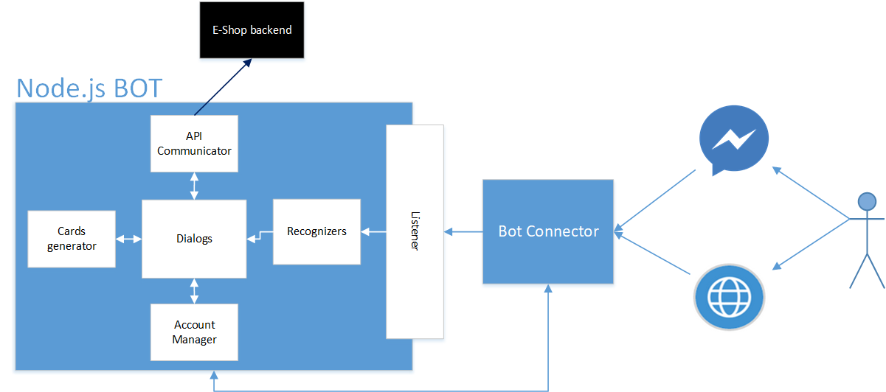
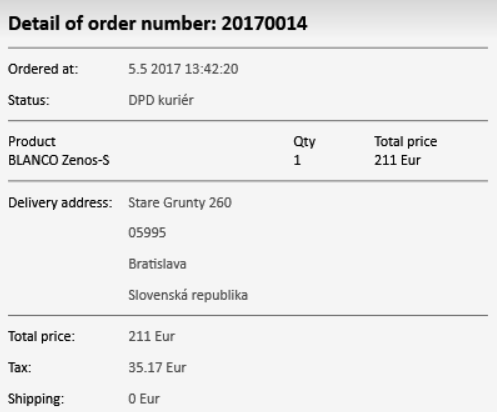
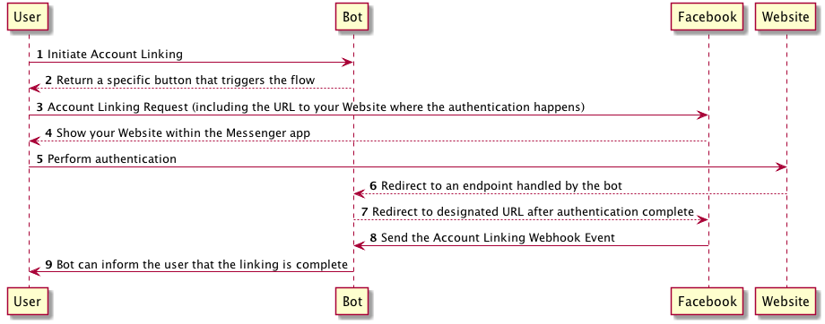
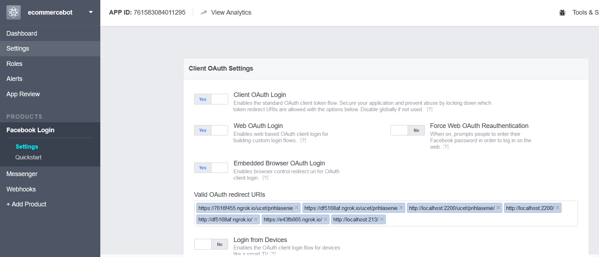
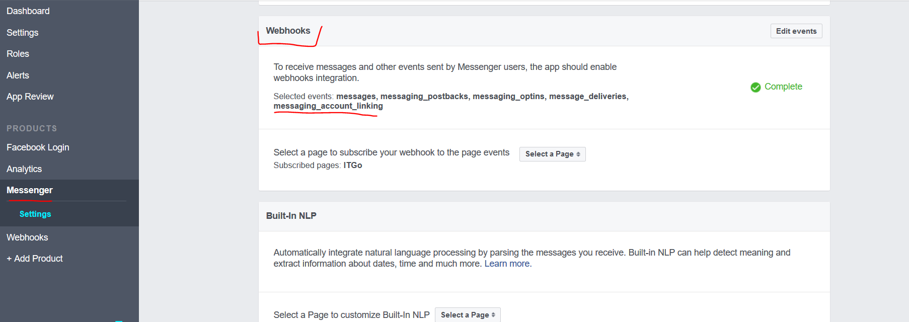

# E-commerce Chat Bot

Microsoft teamed up with SmartBase for a series of hackfests to create conversational chat bot feature for their white label e-commerce solution. Functionality of the first bot version is following:

·       Showing order details

·       Product browsing (including natural language filtering)

·       Shopping cart management

·       FAQs Search

·       Blog posts search

The bot is built in TypeScript on top of Node.js Bot Framework SDK and available thru Facebook Messenger and directly thru embedded chat window on e-shop web site using Direct Line. As SmartBase is targeting customer’s not only from local market, bot supports localization.

## **Overview**

Chat bot development was divided into following interconnected parts:

1. **Preparation of backend API **– development of the SmartBase’s e-commerce platform started longer time ago and it was originally built as a Django MVC Web Application without API services available for consumption by mobile or bot application. Thus, there was need to prepare REST services, which were subsequently utilized by conversational bot. We will not be discussing this API in detail in this text, as our focus lays on the chat bot part.
2. **Connecting bot to API and displaying content **– in first phase we have implemented main part of the bot application, which was consuming e-commerce solution services and was delivering content to user thru Messenger and Direct Line.
3. **Login implementation** - some of the APIs require user authentication (shopping cart management, displaying of order details). In Messenger channel we have implemented login logic using [Messenger *account linking feature*](https://developers.facebook.com/docs/messenger-platform/identity/account-linking), which allows bot to authenticate user within the e-shop login page using OAuth flow and forward authentication token to bot chat window. In direct line chat window embedded into the e-shop web site we forward token thru parameters when embedding the chat control.
4. **Implementation of proactive messaging **– as bot should serve as an up-selling channel, we have also implemented proactive messaging thru Messenger channel. We utilize proactive messaging feature when backend regular check notices “full basket, no order” status for the user. 
5. **Custom recognizers implementation **– we allow certain degree of freedom within conversation, but as too big level of freedom may lead to bad user experience, we decided to primarily go by the way of commands invokable thru action buttons or typing. For this purpose, we have built custom command recognizer and in addition we use regexp recognizers as well.
6. **Localization**– SmartBase is targeting customers not only from local market, thus bot has to support localization. For the first version we have worked on support for Slovak and English language.
7. **Natural Language Processing in product filtering ** - bot allows users to use advanced natural language product filtering (e.g. show me stainless water taps bellow 80 Euros). For this purpose we wanted to use Language Understanding Intelligent Service (LUIS) first, however due to reasons discussed further in the document, we have decided to utilize **Elastic Search** and defined regexp rules, which effectively extract conditions stated in the natural language query.
8. **Bot Application Monitoring** – to get insights on how the bot is being used, we have connected our bot to Application Insights, to collect usage and error logs.

###  Core team:

·       Jakub Kacur – Senior developer of SmartBase’s e-commerce platform; SmartBase

·       Marek Lani – CSE Technical Evangelist; Microsoft

### **Customer profile**

SmartBase (legal name Ligthwell) is Microsoft Partner, member of BizSpark program, ISV and Software development house with more than 20 developers, which focuses on cutting edge technologies. SmartBase was established in 2014 and is quickly growing company. SmartBase develops custom software for European and U.S. customer, but their focus lays on their product - freshly rebuilt e-commerce white label platform, which is built on OSS technologies such as Django, vue.js or Docker on Linux. 

### **Problem statement**

SmartBase operates on the market of e-commerce solutions, which is saturated with plenty of existing solutions, and so they are in never ending search of new, unique features, which would distinguish their solution from competition. Thanks to using Azure as a hosting platform, SmartBase can secure high availability and scalability of the solution. Their solution has also various specific features e.g.  automation of shopping process via creation of ad hoc discounted product packages to support up sell, simple integration with systems of shipping companies and many more. However, they were looking for some “sexy” feature, which would generate buzz around the solution from marketing point of view and would deliver added value to customers at the same time. They were searching for the ways how to find new customer channels for their customers and how to provide automated support channel. With raising popularity of bot solutions, it became a natural choice to create and offer conversational bot as a part of premium features of their e-commerce platform. To make this project successful, SmartBase also assists their customers to raise awareness of the bot thru social and emailing channels.

## **Solution, steps and delivery**

Based on SmartBase’s technology stack and knowledge base, we have decided to use TypeScript and Node.js Bot Framework SDK. In the beginning of this section we briefly describe modules, which built up the bot and its message flow. Architecture of the bot solution is following:

 

*Figure 1: Chat Bot Architecture*

Bot is accessible thru Messenger and Direct line injected to e-shop web page. User messages flow to Bot Framework's Bot Connector which then forwards them to the bot application built using Node.js Bot Builder SDK. Entry point of the bot application is listener, listening for messages. Messages are then routed to recognizers, where the detection of intent and entities takes place. Afterwards bot invokes corresponding dialog. If the invoked dialog is responsible for surfacing e-shop data, it invokes API Communicator methods, to make request to e-shop API. Majority of displayed content is displayed using cards, while creation of card reply is done within cards generator module. As stated, some of the API services require users to be logged in. Login and logout functionality is implemented within Account Manager module. Once the reply structure and content are built up, dialog sends reply to user via Bot Connector.

In following subsections we will describe specific parts of bot in deeper detail.

### **Connecting bot to API and displaying content **

Connection to the API and request to specific service is invoked from the dialog, which corresponds with the determined user intent. Execution of the request itself is implemented within API Communicator module using request client supporting javascript promises (request-promise). Below is example of API request code which requires authentication. All API services, even the ones which does not need users to login are secured using API key, which is part of bot application settings.

```javascript
//request.js
var rp = require('request-promise');
...
showCart: function (session) {
        return new Promise((resolve, reject) => {
            //check validity of authentication token, if invalid refresh
            checkTokenValidity(session).then(function (result) {
                //getData
                if (result) {
                    var storedToken = session.userData.token;
                    if (storedToken) {
                        var res = rp(BackendUrl + '/basket', { headers: { 'Authorization': 'Bearer ' + storedToken, 'ApiKey':API_KEY } })
						
                        res.then(function (err, result) {
                            if (err)
                                return reject(err);
                            return resolve(result);
                        });
                    }
                    else return reject("token error")
                }
            });
        });
    }
```

 E-shop API contains following services:

- Listing product categories and products
- Product search
- Displaying and managing shopping cart (adding/removing products)
- FAQs search
- Searching in blogs
- Displaying list of orders and order details (last order, search for specific order using order number)
- Authentication token refresh


Once dialog receives json result from the API Communicator, it starts to process it. In majority of dialogs, we utilize rich card to display content to users. To create these cards, we have implemented **Cards module**, which utilizes Bot Builder SDK to create cards. Below is example of creation of carousel hero card reply to display product categories:

~~Cards.js~~

```javascript
//cards.js
import builder = require('botbuilder');
...

createCategoriesCards: function(session, jsonObject)
{
    var cards = [];
    var locale = getLocale(session);
    
    jsonObject.categories.forEach(function(item,index){

      var command = "@showProducts:"+item.slug;
        cards.push(new builder.HeroCard(session)
            .title(item.name)
            .text('')
            .images([new builder.CardImage().url(ac.BACKEND_URL+item.img).alt(item.name)])
            .buttons([
				//creates command postback button
                builder.CardAction.postBack(session, command, session.localizer.gettext(locale, "showProducts"))
            ])
        );       
      }); 
    return cards;
 }
```
Some cards needed broader customization and so we have also utilized [Adaptive cards](http://adaptivecards.io/), for instance for order details card. On Facebook Messenger this card displays as a picture, as Messenger has limited support for adaptive cards so far, but in our case, this is sufficient. Bellow you can see example of order detail card displayed on Messenger. We did not use Facebook’s receipt template, as it did not provide sufficient level of content customization. Bot also utilizes capability of Bot Builder to send channel specific payload and we use few Messenger card templates e.g. [generic template](https://developers.facebook.com/docs/messenger-platform/send-messages/template/generic) to display contact information.

 



 *Figure 2: Order Detail Adaptive Card displayed on Facebook Messenger*

In [orderCard.js file](code/OrderCard.js) located within this repo, you can find function responsible for creation of order using Adaptive Cards.

### Login implementation: 

Some of the e-shop APIs consumed by the bot require authentication of user (shopping cart management, displaying of order details). Bot is available thru Messenger and Direct Line channels, while both channels implement the login logic in different manner:

#### Messenger Login: 

Messenger login is implemented using [Messenger account linking feature](https://developers.facebook.com/docs/messenger-platform/identity/account-linking), which allows us to authenticate user directly within the e-shop page using OAuth flow and forward authentication token to bot chat window. Bellow we are referencing sequence diagram of the login process using account linking.



*Figure 3: Account Linking sequence diagram, Source: https://blog.vjrantal.net/2016/11/15/facebook-account-linking-with-microsoft-bot-framework/*

Implementation steps of login on Messenger were following:

1.    Implementation of account linking login card displayed within login dialog

      ```javascript
      //Login Card
      login: function (session) {
            var locale = getLocale(session);
            //using messenger native card template
            var message = new builder.Message(session)
                .sourceEvent({
                facebook: {
                    attachment: {
                        type: 'template',
                        payload: {
                            template_type: 'generic',
                            elements: [{
                                    title: session.localizer.gettext(locale, "eshopLogin"),
                                    // image_url: FRONTEND_URL + '/static/linking.png',
                                    buttons: [{
                                            type: 'account_link',
                                            url: LOGIN_URL
                                        }]
                                }]
                        }
                    }
                }
            });
            session.endDialog(message);
        }
      ```

2. Logout action invoked by logout dialog.

   ```javascript
   //logoutActionCode.js

   logout: function(session){
             request({
                   url: 'https://graph.facebook.com/v2.6/me/unlink_accounts',
                   method: 'POST',
                   qs: {
                       //You can obtain this in fb dev portal -> your bot app -> Products:Messenger -> settings
   					access_token: 'FacebookPageAccessToken'  
                   },
                   body: {
                       psid: session.message.address.user.id
                   },
                   json: true
                   }, function (error, response, body) {
                   if (!error && response.statusCode === 200) {
                       // In case of success no need to send anything to user
                       // since we respond only after
                       // we have received the account unlinking webhook
                       // event from Messenger
                       session.endDialog();
                   } else {
                       var locale = getLocale(session);
                       session.endDialog(session.localizer.gettext(locale, "loggoutError"));
                   }
               });
       }
   ```


3. Login page and OAuth login flow on the e-shop side
4. Setting up Facebook Login product in Facebook application linked to the bot: to implement Account Linking there is need to configure Login product of the Facebook application, more specifically valid OAuth redirect URIs where there is login form published. After clicking on login button within Messenger chat window, user is redirected to this URL, which is part of eshop.
5. Besides configuring Login Product, it is necessary to add Account Linking (messaging_account_linking) web hook in Messenger product.


6. Bot login handle, which gets invoked by the backend after user logs in. This request contains following parameters: *redirect_uri*, *token*, *refresh token* (used to invoke refresh token API, which refreshes expired authentication token) and name of logged in user. Bot login handle first calls *redirect_uri* which is designated to let Facebook know, that login has been completed. This call contains *authorization_code* parameter, which contains *token*, *refresh_token* and *user_name* delimited by ";". *Authorization_code* parameter is parameter which is sent by subsequent Messenger webhook event back to the conversation. We send token back and forth as bot login handle itself is not session/conversation aware and we need to connect token with specific user session once we receive conversation webhook from Messenger. Bot login handle is stated in code below:

   ```javascript
   //BotLoginHandle
   server.get('/authorize', restify.queryParser(), function (req, res, next) {
     if (req.query && req.query.redirect_uri && req.query.token) {
         var token = req.query.token;
         var refreshToken = req.query.refresh_token;
         var userName = req.query.user_name;
         // The authorization_code query string
         // argument is an arbitrary pass-through value that could be stored as well
         // to enable verifying it once Facebook sends the `Account Linking webhook event
         // In this case, we are passing the API token, refresh token and username via the authorization_code, while token is our verification value
         var redirectUri = req.query.redirect_uri + '&authorization_code=' + token + ';' + refreshToken + ';' + tokenGeneratedAt + ';' + userName;
         return res.redirect(redirectUri, next);
     } else {
         return res.send(400, 'Request did not contain redirect_uri token or username in the query string');
     }
   });
   ```


7. Once webhook event is fired by Messenger, bot receives it as message of type ‘Account linking’. We process this message in default dialog. This processing consists from deserialization of *authorization_cod*e parameter and storing token, refresh token and user name into session. We determine whether bot received linking (logged in) or unlinking (logged out) event thru *accountLinking.status* variable. If user logged out, we simply delete stored bot session data for the user. Even though Facebook notifies user about the linking event automatically, we added also custom messages notifying user about being logged in or logged out.  ~~accountLinkingWebhook~~

   ```javascript
   ...
   //AccountLinkingWebhook

   var accountLinking = session.message.sourceEvent.account_linking;
   if (accountLinking)

     // This is the handling for the `Account Linking webhook event` where we could
     // verify the authorization_code and that the linking was successful.
     var data = accountLinking.authorization_code;

     var authorizationStatus = accountLinking.status;
     if (authorizationStatus === 'linked') {
       var data = data.split(';');
       // Persist token and userName under the userData
       session.userData.token = data[0];
       session.userData.refreshToken = data[1];
       session.userData.tokenGeneratedAt = data[2];
       var name = data[3];
       session.userData.userName = name;
       var message = cards.CreateReplyWithMenuActions(session,session.localizer.gettext(locale, "loggedIn") + name);
       session.endDialog(message); 

       //We need to save address for proactive messaging (send it to backend)
       am.saveAddress(session.message.address, data[0]);

       var eventTelemetry = telemetryModule.createTelemetry(session);
       aic.trackEvent(eventTelemetry,'AccountLinked');

     } else if (authorizationStatus === 'unlinked') {
       // Remove username from the userData
       delete session.userData.token;
       delete session.userData.userName;
       delete session.userData.tokenGeneratedAt;
       var message = cards.CreateReplyWithMenuActions(session,session.localizer.gettext(locale, "loggedOut"));
       session.endDialog(message); 
     } else {
       session.endDialog(session.localizer.gettext(locale, "loggedOutError"));
     }
     var eventTelemetry = telemetryModule.createTelemetry(session);
     aic.trackEvent(eventTelemetry,'AccountUnlinked');
     }
   };
   ...
   ```


#### Direct Line login

To inject chat feature to e-shop website we used Direct Line in combination with [Embeddable web chat control for the Microsoft Bot Framework](https://github.com/Microsoft/BotFramework-WebChat) which provides us an embeddable element connected to direct line. To authenticate, user needs to login on the e-shop page itself. Subsequently we forward authentication token to embedded window thru *user:id* parameter:

```html
<!--PageLogin-->
<html>
	<head>
		<link href="https://unpkg.com/botframework-webchat/botchat.css" rel="stylesheet" />
		...
  	</head>
	<body>
      <div id="bot"/>
      <script src="https://unpkg.com/botframework-webchat/botchat.js"></script>
      <script>
        BotChat.App({
          directLine: { secret: 'DirectLineKey'},
          user: { id: 'authToken;refreshToken;tokenGeneratedAt', name: 'userName' },
          bot: { id: 'ecommercebot' },
          locale:"sk",
          resize: 'detect'
        }, document.getElementById("bot"));
      </script>
      ...
   	</body>
 </html>		
```
Once chat window is embedded in described way, every message routed to bot application contains following field: *session.message.user.userid*. We utilize this to feed session with token, refresh token and user name data within bot builder middleware in the following way:

```javascript
//middlewareForPageLogin
bot.use({
	botbuilder: function (session, next) {
      session.sendTyping();
      //Check whether user is logged in on the eshop page
      if (!session.userData.token && (session.message.address.channelId === 'directLine')) {
          var data = session.message.user.userid.split(';')

          session.userData.token = data[0];
          session.userData.refreshToken = data[1];
          session.userData.tokenGeneratedAt = data[2];
      }
      ...
    }
});
```


### Implementation of proactive messaging

As bot should serve also as an up-selling channel, we have implemented proactive messaging on Messenger channel. We utilize proactive messaging feature, when backend’ s regular check notices simply said “full basket, no order” status for the user. When publishing bot on Facebook, we submitted bot application also for *pages_messaging_subscriptions* review, so we can send proactive messages not only within 24 hours period from when the last message was sent by user, but anytime after first user interaction. To allow this proactive messaging we needed to implement backend service, which we send address of the conversation to. This address gets stored for further proactive messaging needs. This address is subsequently sent back to bot application, once e-shop backend recognizes need to send proactive message to specific user. On the bot application side we needed to implement following functionality:

- Conversation address post request to backend:

  ```javascript
  //Default dialog, after login
  accountManager.saveAddress(session.message.address,data[0]);
  ```

  ```javascript
  //accountManagerSaveAddress
  var rp = require('request-promise');
  ....
  saveAddress: function(address, token)
  {
  	 var postOptions = {
  		method: 'POST',
  		uri: ac.BackendUrl + '/address',
  		body: {
  			address: address,
  			token: token
  		},
  		json: true
  	};
  	rp(postOptions);
  }
  ```


- Bot endpoint for proactive message, which gets called by e-shop backend

  ```javascript
  server.use(restify.bodyParser());
  server.post('/proactivemessage', function (req, res) {
      var address = req.body.address;
      var notification = req.body.notification;
      var msg = new builder.Message().address(address);
      msg.text(notification);
      bot.send(msg);
  })
  ```

### Recognizers implementation 

Our bot supports certain degree of freedom in conversation, but we decided to utilize mainly commands approach. We display buttons and action recommendations, which posts back commands (messages in format *@command:entity*). These commands get recognized thanks to custom command recognizers. When creating custom recognizer, we got inspired by this blog post: <http://www.pveller.com/intent-recognizer-for-a-chatbot/>. If bot does not recognize command it continues with regular expression intent recognition supporting localization to English and Slovak language. 

Intent recognition flow for our bot is declared like this:

```javascript
//recognizersFlow
var commands = require('./recognizers/commands');
...
var intents = new builder.IntentDialog({
    recognizers: [
        commands,
        new builder.RegExpRecognizer("showCart", { sk: /^((zobraz(i(t|t))?|uk(á|a)(z|ž)(a(t|t))?)\s*)?(n(a|á)kupn(y|ý)\s*)?(ko(š|s)(í|i)k)/i, en: /^((shopping\s*)?cart)/i }),
        new builder.RegExpRecognizer("faqSearch", { sk: /^((c|c)asto kladen(e|é) ot(a|á)zky|faq)/i, en: /^(frequently asked questions|faq)/i }),
        new builder.RegExpRecognizer("login", { sk: /^(login|prihl(a|á)si(t|t)(\s*sa)?|prihl(a|á)senie)/i, en: /^(login)/i }),
        ...other regexp recognizes
        otherCustomRecognizers
    ],
    intentThreshold: 1,
    recognizeOrder: builder.RecognizeOrder.series
});

bot.dialog('/', intents);
```

Custom commands recognizer:

```javascript
//commandsRecognizer

const unrecognized = {
    entities: [],
    intent: null,
    intents: [],
    score: 0
};

const parse = {
    parse: function (context, text) {
        const parts = text.split(':').map(function(item) {
                        return item.trim();
                      });;
        const command = parts[0];

        console.log('Resolved [%s] as [%s] command', text, command);

        const action = this[command] || this[command.slice(1)];
        if (!action) {
            return unrecognized;
        } else {
            return action.call(this, context, parts.slice(1));
        }
    },
    showCart: () => ({
        intent: ("showCart"),
        score: 1
    }),
    showCategories: () => ({
        intent: ("showCategories"),
        score: 1
    }),
    showProducts: (context, parent) => ({
        entities: [{
            entity: parent,
            score: 1,
            type: 'Category'
        }],
        intent: ('showProducts'),
        score: 1
    }),
    addToCart: (context, parent) => ({
        entities: [{
            entity: parent,
            score: 1,
            type: 'AddToCartUrl'
        }],
        intent: ('addToCart'),
        score: 1
    }),
	//...other commands
};

module.exports = {
    recognize: function (context, callback) {
        const text = context.message.text;

        if (!text || (!text.startsWith('@')) {
            callback.call(null, null, unrecognized);
        } else {
            callback.call(null, null, parse.parse(context, text));
        }
    }
};
```

## Localization

Bot supports localization of prompts and messages sent to user. User is offered also an option to select preferred language. By default, this preference is set to our local (Slovak) language. This preference is subsequently used when selecting right string to be displayed. Language selection prompt dialog is implemented in following way:

```javascript
//changeLanguage 
bot.dialog('/changeLanguage',[
        function (session) {
            var locale = getLocale(session);
            // Prompt the user to select their preferred locale
            builder.Prompts.choice(session, session.localizer.gettext(locale, "language"), session.localizer.gettext(locale, "languageOptions"));
    },
    function (session, results) {
        // Update preferred locale
        var locale;
        switch (results.response.entity) {
            case session.localizer.gettext(locale, "enoption"):
                locale = 'en';
                break;
            case session.localizer.gettext(locale, "skoption"):
                locale = 'sk';
                break;
        }
        session.preferredLocale(locale, function (err) {
            if (!err) {
                // Locale files loaded
                session.endDialog(session.localizer.gettext(locale, "preferedLanguage"), results.response.entity);
            } else {
                // Problem loading the selected locale
                session.error(err);
            }
        });
    }
```

To obtain locale preference we created utility method *getLocale*:

```javascript
//getLocale
global.getLocale = function(session)
{
       var locale = session.preferredLocale()
        //currently support only for sk or en, we choose en for every other locales as Facebook Messenger sets preferredLocale to user's default language
		if (locale != 'sk')
			locale = 'en';
        return locale;
}
```

Json files with localization resources were added into locale -> en, resp. locale -> sk folders. Localization of prompts and strings is then done in following way:

```javascript
//useLocalization
var locale = getLocale(session);
session.send(session.localizer.gettext(locale, "LocalizedStringKey"));
```

~~~~

As already stated, localization was implemented also within Regular Expression Recognizer and is demonstrated in code fence in previous section.

### Natural Language Processing in product filtering

Bot allows users to use advanced natural language product filtering (e.g. show me stainless water taps bellow 80 Euros). For this purpose, we wanted to use Language Understanding Intelligent Service (LUIS) first, however it does not support Slovak language. We have experimented with creation of translation middleware, which would translate messages to English using Bing Translate API before sending them to LUIS. This however turned out to deliver low quality and precision of intent recognition. We have decided to utilize **Elastic Search** and defined regexp rules, which effectively extract conditions stated in the natural language query. Bellow you can see python script, which implements this filtering capabilities on the e-shop backend side:

```python
#pythonElasticScript
es_query_products['size'] = 4
price_regex = re.search(r'(do|nad|od|pod|okolo)?\s*([\d]+)\s*(eur|euro|E|€)*', es_search, )
less_text = ['do', 'pod']
more_text = ['od', 'nad']
if price_regex:
    if price_regex.group(1) and price_regex.group(1) in less_text:
        es_query_products['query']['bool']["filter"] = {'range': {'price_incl_tax': {"lte": price_regex.group(2)}}}
    elif price_regex.group(1) and price_regex.group(1) in more_text:
        es_query_products['query']['bool']["filter"] = {'range': {'price_incl_tax': {"gte": price_regex.group(2)}}}
    else:
        es_query_products['query']['bool']["filter"] = {'range': {
            'price_incl_tax': {
                "lte": int(price_regex.group(2)) + config.SEARCH_PRICE_DIFF,
```


## Usage monitoring  

To monitor bot usage and collect error logs, we have used Application Insights using official [npm Application Insights package](https://www.npmjs.com/package/applicationinsights). We have implemented Application Insights helper and imported and used it when handling conversation flow in dialogs.

```javascript
//ApplicationInsightsHelper
import appInsights = require("applicationinsights");

//Set Log Auto Collection
appInsights.setup('InstrumentationKey')
    .setAutoDependencyCorrelation(true)
    .setAutoCollectRequests(true)
    .setAutoCollectPerformance(true)
    .setAutoCollectExceptions(true)
    .setAutoCollectDependencies(true)
    .setAutoCollectConsole(true)
    .start();
	
// Helper for manual log collections
var appInsightsClient = appInsights.getClient('InstrumentationKey');
var telemetryModule = require('./telemetryModule');

export =  
{
    trackException: function(session,error)
    {
        appInsightsClient.trackException(error);
    },

    trackTrace: function(resumeAfterPromptTelemetry, message)
    {
        appInsightsClient.trackTrace(message, resumeAfterPromptTelemetry);
    },
    
    trackEvent: function(measuredEventTelemetry, eventName)
    {
        appInsightsClient.trackEvent(eventName, measuredEventTelemetry);
    },
    
    trackRequest: function(req, res)
    {
        appInsightsClient.trackRequest(req, res);
    }
}
```

Usage of *Application Insights helper* in dialog:

```javascript
//applicationInsigthsInDialog
var rp = require('request-promise')
import ac = require('./../APICommunicator');
import cardsModule = require('../cards')
import builder = require('botbuilder');
import aic = require('./../appInsightsClient');
var telemetryModule = require('./../telemetryModule');

 module.exports = function(bot){
    bot.dialog('/showCategories',[
        function(session, args,next)
        {   
            var locale = getLocale(session);        
            session.sendTyping();
            
            res =  ac.showCategories(session)
            res.then(function(result)
            {
                //process resposne
				...

				//create json eventTelemetry
                var eventTelemetry = telemetryModule.createTelemetry(session);
                aic.trackEvent(eventTelemetry,'ShowCategories');
            },
            function(err)
            {
                var message = session.localizer.gettext(locale, "categoriesError");
                var reply = cardsModule.CreateReplyWithMenuActions(session,message);
                
				//track and end dialog
				session.endDialog(reply);
                aic.trackException(session,err);
            })
            .catch(err => {
               var message = session.localizer.gettext(locale, "categoriesError");
               var reply = cardsModule.CreateReplyWithMenuActions(session,message);
               
			   //track and end dialog
			   session.endDialog(reply);
               aic.trackException(session,err);
            });
        }
    ]);
 };
```


## **Conclusion**

To sum up, within our technical engagement with SmartBase we’ve delivered first e-commerce bot in local market, which is offered as a unique feature within their white label e-commerce solution. Smartbase has already on boarded first customer, who utilizes bot feature (<https://drezydokuchyne.sk/>), while SmartBase cooperates with this customer on building marketing strategy connected to the bot.

### **Learning, findings and challenges:**

Thru our work on project we faced several challenges and issues, which brought us following learnings and findings:

**Messenger limitations**: there were several limitations, which we faced, when it comes to displaying cards and actions on Messenger channel:

- Adaptive card displayed only as image
- Action buttons on messenger rendered as quick replies does not support url redirect, so for the actions where we wanted to redirect user to e-shop page, we had to use card with url buttons.

**Facebook bot publication:** Certification, respectively approval process can take up to 5 business days. If you want to utilize time unlimited proactive messaging, you need to implement confirmation dialog, where user will give consensus with this messaging. People from Facebook are taking the approval process rigorously and you really can see multiple approvers chatting with your bot.

**HTTPS endpoints needed during development:** While developing and testing bot on Messenger channel, we needed to have both bot application and e-shop backend hosted on https endpoint, as Bot Connector and Facebook required secured communication channel. To achieve that and to avoid deployment of bot and backend to server with configured https during time of development, we have utilized [**ngrok**](https://ngrok.com/) on both sides. This however caused problems during login phase when the redirect to login page was done as there was large number of request generated, which exceeded ngrok free quota for number of requests per minute. We have mitigated this problem by omitting CSS files and surfacing just clean html login page while testing.

**LUIS integration and translation** – as stated, we wanted to implement LUIS integration for natural language processing, however due to the fact, that LUIS does not support Slovak language, we tried to add translation middleware using Bing Translate. However due to lack of context and short messages, Bing Translate was not able to provide precise translation nor LUIS was providing correct intent identifications. Therefore, we sticked with the regexps and phrase matching feature of Elastic Search for now.

### **Next development:**

As a next step there is a plan to **finalize shopping process and payment thru the bot**. This is however not possible yet due to unclear local legislation when it comes to conversational bots and payments. 

As stated, we have implemented also usage monitoring mechanism, which helps us to identify usage patterns. We plan to monitor these and act on the insights by altering set of existing functionalities, respectively by providing even **easier way how to invoke specific functionality** thru bot.

We also would like to experiment with **extending of support for Natural Language Processing**. This however has prerequisite in form of language support of LUIS, as at the current point, majority of customers for SmartBase's e-commerce platform is from Slovakia. However, once the number of customers from countries, where they use languages supported by LUIS grows, SmartBase may invest in implementation of LUIS and extending natural language capabilities of the solution.  

As from the March session storage offered by Bot Framework will be deprecated, we plan to **migration of session storage** most probably to Redis Cache offered as a service within Azure.

 